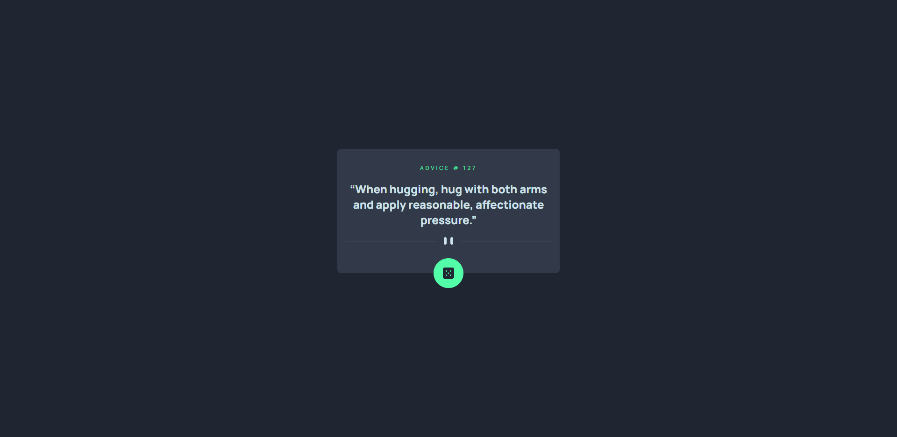
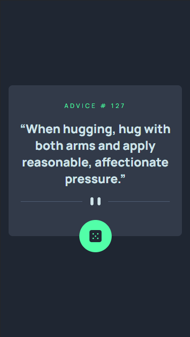

# Welcome! 👋

This is a solution to the [Advice generator app challenge on Frontend Mentor](https://www.frontendmentor.io/challenges/advice-generator-app-QdUG-13db). Frontend Mentor challenges help you improve your coding skills by building realistic projects.

## Table of contents

> \* Sections denoted with 'x' are not yet complete!

- [Overview](#overview)
  - [The challenge](#the-challenge)
  - [Screenshot](#screenshot)
  - x [Links](#links)
- x [My process](#my-process)
  - x [Built with](#built-with)
  - x [What I learned](#what-i-learned)
  - x [Continued development](#continued-development)
  - x [Useful resources](#useful-resources)
- [Author](#author)

## Overview

### The challenge

Users should be able to:

- View the optimal layout for the app depending on their device's screen size
- See hover states for all interactive elements on the page
- Generate a new piece of advice by clicking the dice icon

### Screenshot

|  |  |
| ---------------------------- | --------------------------- |
| Desktop version              | Mobile version              |

### Links

<!-- - Solution URL: [Add solution URL here](https://your-solution-url.com) -->
<!-- - Live Site URL: [Add live site URL here](https://your-live-site-url.com) -->

## My process

### Built with

### What I learned

### Continued development

### Useful resources

## Author

- Frontend Mentor - [@tyran0](https://www.frontendmentor.io/profile/tyran0)
